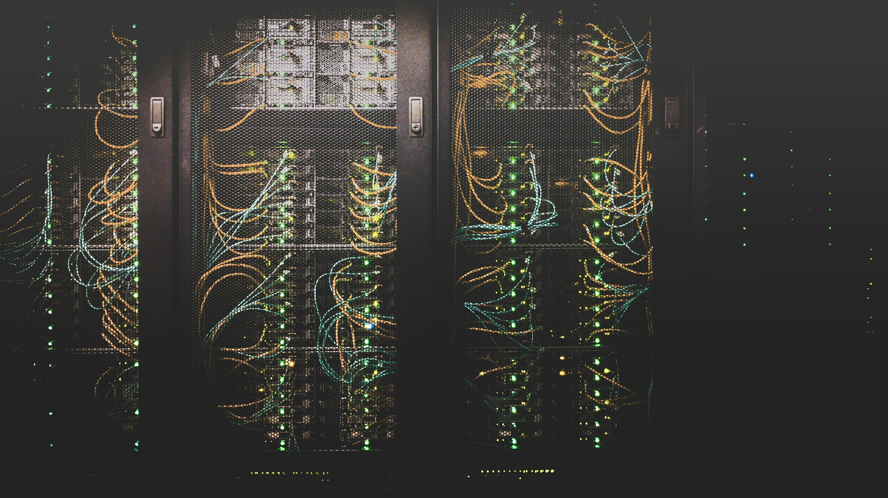

# 2025年法国顶级虚拟主机服务：选对主机，网站快人一步

---

你可能已经发现了：在法国建站，选错主机服务商就像给自己挖坑——要么速度慢得让人抓狂，要么续费价格突然翻倍，要么客服永远找不到人。2025年的法国主机市场已经相当成熟，但问题是选择太多反而让人无从下手。这篇文章会帮你理清思路：哪些服务商真正靠谱？哪些适合你的具体需求？从新手友好型到技术控专属款，从预算紧张到追求极致性能，我们把市面上值得考虑的主机服务都梳理了一遍。

---

## 先说说法国主机市场的三大阵营

法国的虚拟主机市场其实挺有意思的。大致可以分成三类玩家：

**第一类是"稳扎稳打"型**——这些服务商不追求花哨功能,就是把基本面做得很扎实。AccuWebHosting、GTHost、Alwaysdata这几家就是代表。他们的共同特点是：该有的都有,不该有的问题基本没有。适合那些"我就想好好做个网站,别给我整幺蛾子"的用户。

**第二类是"新手村"型**——Amen.fr、Hosteur.com、FirstHeberg.com这些属于这个类别。他们的控制面板设计得特别傻瓜式,价格也很亲民。如果你是第一次建站,或者只是想搞个小博客小店铺,这些服务商能让你少走很多弯路。

**第三类是"技术流"型**——OVHcloud、Scaleway、PlanetHoster领衔,专攻云主机和可扩展方案。这些服务商给你很大的自由度和控制权,但前提是你得知道自己在干什么。适合那些对服务器配置有明确需求的开发者或成长型企业。

## 逐个看看这些服务商到底怎么样

### AccuWebHosting.com

这家的卖点是"性价比+靠谱客服"。月费€3.99起步,续费€5.99——算是比较良心的价格。他们的客服响应速度确实不错,而且提供免费网站迁移服务。如果你正在用别家的主机不满意想换,这个功能能省你不少事。

适合谁？中小型网站,特别是那些需要偶尔找客服帮忙的用户。

要注意什么？续费比首年贵,但涨幅还在可接受范围内。

### GTHost.com

GTHost主打"速度+安全"。他们的服务器配置比较高,而且标配DDoS防护——这对电商网站或者流量较大的项目来说很重要。月费€5.00起,续费€7.00。

说实话,这个价格在法国市场不算便宜。但如果你的网站对速度和安全性有明确要求,👉 [GTHost的高性能方案值得认真考虑](https://cp.gthost.com/en/join/72c7e6b2fc118929f9ede2978f008806)——毕竟网站加载慢一秒,用户可能就跑了。

适合谁？对性能有要求的商业网站、在线商店。

要注意什么？小型个人博客可能用不上这么强的配置。

### Alwaysdata.com

这家的特色是"灵活可定制"。他们提供免费SSL、无限数据库,而且计划可以根据需求调整。月费€4.90起,续费€6.90。

但问题是:灵活性意味着配置起来可能比较复杂。如果你是技术小白,可能会觉得有点懵。

适合谁？开发者、对主机环境有特殊需求的高级用户。

要注意什么？新手可能需要花时间学习。

### Amen.fr

典型的"新手友好"型服务商。控制面板设计得很直观,提供24/7客服和域名注册服务。月费€2.99起,续费€4.99——价格相当亲民。

但别指望有什么高级功能。这家的定位就是"让建站变简单",而不是"提供专业级配置"。

适合谁？第一次建站的新手、个人博客。

要注意什么？功能相对基础,不适合复杂项目。

### ASPHostPortal.com

专门做ASP.NET主机的服务商,在法国市场比较少见。如果你的项目用的是微软技术栈,这家是不错的选择。月费€3.99起,续费€5.99。

适合谁？使用.NET框架的开发者和企业。

要注意什么？如果你不用.NET,这家的优势对你来说就没什么意义了。

### ContraTeam.com

主打"高安全性+高性能"。标配免费SSL、DDoS防护和SSD固态硬盘。月费€4.00起,续费€6.00。

适合谁？对安全性要求较高的项目。

要注意什么？续费价格涨幅相对较大。

### Coolicehost.com

超级实惠的选择——月费€2.50起,续费€4.50。提供无限带宽和免费SSL,24/7客服也有。

问题是可扩展性比较有限。如果你的网站流量突然暴增,可能需要考虑升级到其他服务商。

适合谁？预算紧张的小企业、个人项目。

要注意什么？不适合快速增长的网站。

### DRI.fr

法国本土的老牌服务商,提供共享主机和独立服务器方案。价格和功能都比较中规中矩:月费€3.50起,续费€5.00。

适合谁？寻求简单可靠方案的中小企业。

要注意什么？功能比较基础,大型项目可能不够用。

### DynamixHost.com

强调"可扩展性+性能"。高在线率、可定制计划、24/7技术支持。月费€4.49起,续费€6.99。

适合谁？预期会快速发展的企业。

要注意什么？续费价格偏高。

### Easy-hebergement.fr

名字已经说明了一切——"简单主机"。控制面板极度简化,还送免费域名和邮箱。月费€1.99起,续费€3.49,是这份榜单里最便宜的选择之一。

当然,低价也意味着功能有限。但如果你就是想快速搭个简单网站,这家完全够用。

适合谁？追求极致性价比的新手。

要注意什么？高级功能基本没有。

### FirstHeberg.com

平衡型选手——价格合理(月费€3.00起,续费€4.99),功能也算齐全(高在线率、无限带宽、SSD存储)。

适合谁？需要可靠服务但不想花大价钱的小企业。

要注意什么？没有特别突出的亮点,也没有明显短板。

### Gandi.net

法国知名的域名和主机服务商,声誉很好。提供免费SSL、域名注册和24/7客服。月费€5.00起,续费€7.50。

价格比同类服务商略高,但如果你需要同时注册域名和购买主机,在一家搞定会省很多麻烦。

适合谁？需要一站式域名+主机解决方案的用户。

要注意什么？单纯比主机服务的话,有更便宜的选择。

### Haisoft.net

性能导向的服务商,提供免费SSL、无限带宽和24/7客服。月费€3.99起,续费€5.99。

适合谁？重视性能和客服质量的企业。

要注意什么？大型网站的选择相对有限。

### Hosteur.com

法国顶级主机服务商之一,专注高性能。SSD存储、无限带宽、高级安全功能都是标配。月费€4.99起,续费€6.99。

适合谁？需要强劲性能和灵活性的成长型企业。

要注意什么？对小型个人网站来说可能有点贵。

### HostMyServers.fr

可靠且实惠的法国本土服务商。免费SSL、24/7客服、无限带宽。月费€2.99起,续费€4.99。

适合谁？寻求性价比的小企业。

要注意什么？功能没有高端服务商那么丰富。

### HQWEB.com

主打"可扩展+安全+快速"。SSD存储、可调整计划、免费SSL、24/7客服一应俱全。月费€4.50起,续费€6.50。

适合谁？需要可扩展方案的成长型企业。

要注意什么？续费价格偏高。

### InovaPerf.fr

专注高性能主机,提供可定制化方案。高性能SSD、DDoS防护、灵活计划配置。月费€4.80起,续费€6.90。

适合谁？对速度和安全性有高要求的企业。

要注意什么？配置起来可能对新手不太友好。

### LeVillage.org

超实惠的选择,主打简单易用。控制面板友好、送免费域名注册、无限带宽。月费€2.50起,续费€4.50。

适合谁？新创业者和小企业。

要注意什么？大企业需要的高级功能基本没有。

### LWS.fr

法国知名主机服务商,价格非常有竞争力。无限带宽、免费SSL、简单的管理工具。月费€1.99起,续费€3.99。

适合谁？小企业和个人网站。

要注意什么？功能相对基础。

### Magic.fr

强调"高在线率+性能"。高在线率保证、免费SSL、24/7客服。月费€3.50起,续费€5.50。

适合谁？重视稳定性和性能的企业。

要注意什么？续费价格有一定涨幅。

### Mejor-hosting.com

实惠可靠的选择。免费SSL、无限带宽、24/7客服。月费€3.00起,续费€5.00。

适合谁？预算有限的小企业。

要注意什么？高级功能有限。

### Nerim.fr

提供灵活强大的定制化方案,适合需要更多控制权的企业。SSD存储、DDoS防护、云主机方案。月费€6.00起,续费€8.00。

适合谁？技术实力较强、需要定制化主机环境的企业。

要注意什么？价格比一般服务商高。

### Netim.com

可靠实惠,主打域名注册+虚拟主机一站式服务。免费SSL、易用控制面板、良好客服。月费€3.20起,续费€5.20。

适合谁？需要同时解决域名和主机需求的小企业。

要注意什么？大型网站的可扩展性有限。

### Nordnet.com

提供共享和独立主机方案,性能稳定。24/7客服、无限带宽、高在线率。月费€3.99起,续费€5.99。

适合谁？中小型企业寻求稳定主机服务。

要注意什么？续费成本相对较高。

### Nuxit.com

适合新手和小企业的法国主机服务商。免费SSL、无限数据库、友好界面。月费€2.80起,续费€4.80。

适合谁？小企业和个人网站。

要注意什么？大型网站的扩展能力不足。

### o2switch.fr

法国知名主机商,以出色性能和可扩展计划著称。无限带宽、免费SSL、24/7客服,而且还强调环保理念。月费€5.00起,续费€7.00。

适合谁？成长型企业,特别是关注环保的企业。

要注意什么？续费价格较高。

### OMGserv.com

高性能主机,主打定制化方案。DDoS防护、SSD存储、灵活计划。月费€4.99起,续费€7.99。

适合谁？需要灵活性和安全性的技术型企业。

要注意什么？续费成本偏高。

### OVHcloud.com

法国领先的主机服务商,提供从云主机到独立服务器的全套方案。云主机、独立服务器、强大安全性。月费€3.49起,续费€5.49。

适合谁？大中型企业,需要企业级可扩展云方案。

要注意什么？比基础主机服务商贵一些。

### Oxyd.fr

可靠的主机服务,强调性能和安全。高在线率、免费SSL、无限带宽。月费€3.50起,续费€5.50。

适合谁？寻求可靠主机的小企业。

要注意什么？高级功能相对有限。

### PlanetHoster.com

多样化主机服务,专注高性能环境。云主机、高在线率、免费SSL。月费€5.00起,续费€7.50。

适合谁？需要可扩展云主机的成长型企业。

要注意什么？续费成本较高。

### Scaleway.com

专注云主机服务,提供强大灵活的解决方案。云主机、SSD存储、可扩展方案。月费€4.99起,续费€6.99。

适合谁？需要可扩展云服务的企业。

要注意什么？技术设置相对复杂。

### Themecloud.io

云主机服务,适合与网站建站工具集成。云主机、快速加载、建站工具集成。月费€4.50起,续费€6.50。

适合谁？使用建站工具的小企业。

要注意什么？客服选项相对有限。

### UndergroundPrivate.com

高安全性主机解决方案,重视隐私和数据保护。高安全性、DDoS防护、匿名主机。月费€6.00起,续费€8.00。

适合谁？需要高安全性和隐私保护的企业。

要注意什么？价格偏高。

### Veesp.com

提供VPS主机和独立服务器,强调性能和可扩展性。VPS主机、独立服务器、高在线率。月费€5.99起,续费€7.99。

适合谁？需要VPS或独立服务器的企业。

要注意什么？对新手不太友好。

### Wantete.com

实惠可靠的主机,主打简单易用。易用控制面板、免费SSL、无限带宽。月费€2.99起,续费€4.99。

适合谁？小企业或个人网站,追求易管理。

要注意什么？缺少高级定制选项。

### YOORshop

针对电商业务优化的主机服务。电商优化、快速加载、安全交易。月费€6.50起,续费€8.50。

适合谁？想在法国开网店的创业者。

要注意什么？价格比普通主机服务略高。

### yulPa.io

云主机解决方案,适合需要高度灵活性和控制权的企业。云主机、可扩展方案、灵活控制面板。月费€5.50起,续费€7.50。

适合谁？技术型企业需要灵活定制化云主机。

要注意什么？对新手可能过于复杂。

---

## 最后说两句

选主机这事儿其实没那么玄乎。核心就是搞清楚三个问题:你的网站类型是什么?预期流量多大?技术能力怎么样?

如果你是新手或者只想搞个简单网站,LWS.fr、Easy-hebergement.fr这些低价简单的方案完全够用。如果你是开发者或者对性能有明确要求,👉 [那些提供更多控制权和更强性能的服务商会更适合你](https://cp.gthost.com/en/join/72c7e6b2fc118929f9ede2978f008806)。

说到底,好的主机服务应该让你感觉不到它的存在——网站快速稳定,问题能及时解决,价格在预算范围内。这就够了。
